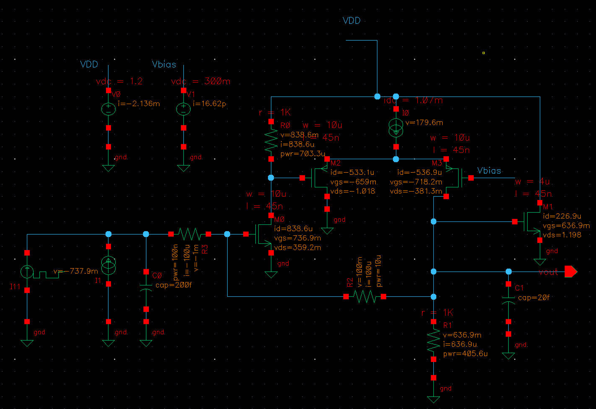
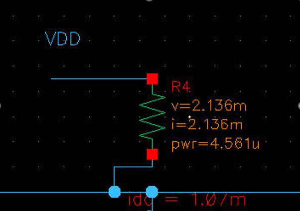
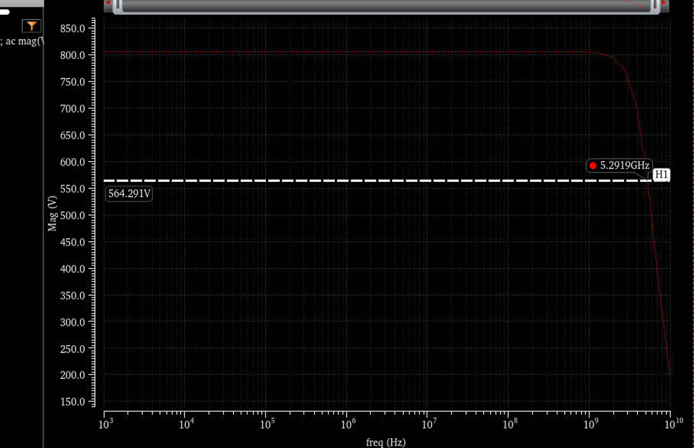
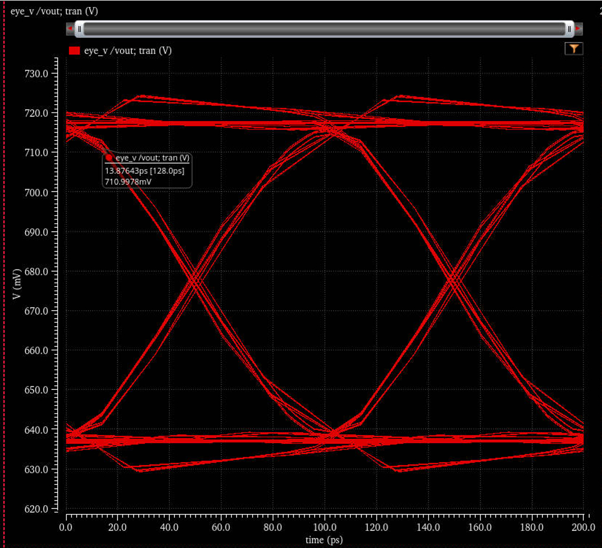

# 10Gbps TIA in 45nm CMOS Technology 
**Last updated:** March 11, 2024

This project involved the design and simulation of a 10 Gbps Transimpedance Amplifier (TIA) using 65/45nm CMOS technology. The primary goal was to achieve high performance while meeting specific requirements for gain, bandwidth, input-referred noise (IRN), and power consumption.

## TIA Design and Simulation Result
| Parameter   | Value           |
|-------------|-----------------|
| Gain        | 564.3 Ω         |
| Bandwidth   | 5.292 GHz       |
| IRN         | 12.2 pA/√Hz     |
| BER         | 3.49×10⁻¹²      |
| Power (DC)  | 2.56 mW         |

## Circuit Design and Parameters
### DC Operation Point:

<figure>
  
  <figcaption>Figure 1. Circuit Design and Parameters.</figcaption>
</figure>

<figure>
  
  <figcaption>Figure 2. Total current I = 2.136mA, makes PDC = 2.56mW</figcaption>
</figure>

<figure>
  
  <figcaption>Figure 3. AC MagnitudeGain = 564.3Ω</figcaption>
</figure>

<figure>
  
  <figcaption>Figure 4. Eyediagram with noise</figcaption>
</figure>

